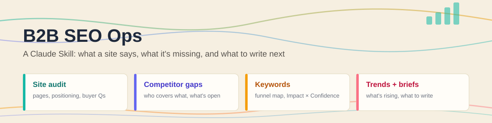
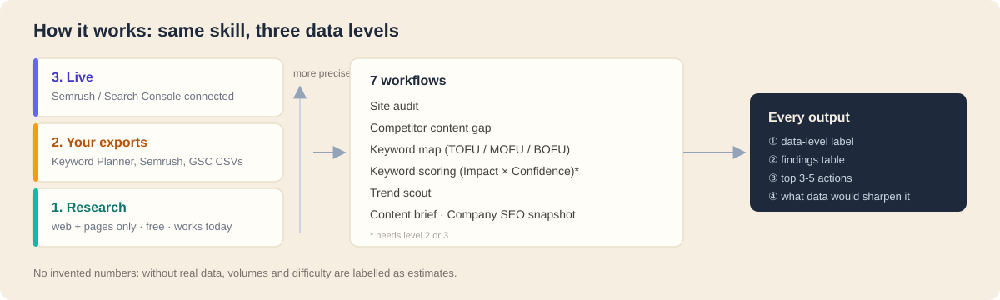

# B2B SEO Ops

A Claude Skill that tells you what a website says, what it's missing, what competitors cover that it doesn't, what's trending in the space, and what to write next. Built for B2B marketers, and it works with **no paid SEO tools**.

## The problem it solves

Most SEO skills and tools assume you have an Ahrefs or Semrush API plan and Google Search Console access to the site. Without those, they don't run at all. But a lot of useful SEO work doesn't need them: reading a site the way a buyer would, spotting the questions it never answers, and seeing which topics competitors own.

This skill works at three data levels and **always tells you which one it's using**:
1. **Research**: web search and reading pages. Free, and works today.
2. **Your exports**: paste or attach a Google Keyword Planner, Semrush, Ahrefs, or Search Console file, and it uses the real numbers.
3. **Live**: if Semrush or Search Console is connected to Claude, it pulls data directly.

It never invents search volumes, difficulty scores, or rankings. Without real data, it says "estimate", not a made-up number.

## How to use it (no coding required)

1. **Get the skill.** Download this folder (`b2b-seo-ops`), either by cloning the repo or by downloading just this folder from GitHub.
2. **Add it to Claude.**
   - **Claude app:** turn on *Code execution and file creation* in Settings → Capabilities. Download the ready-made [`b2b-seo-ops.zip`](../b2b-seo-ops.zip) (or zip the `b2b-seo-ops` folder yourself), then Customize → Skills → **+** → Upload a skill. Upload the zip itself, not a file inside it. See [Anthropic's skills documentation](https://docs.claude.com/en/docs/agents-and-tools/agent-skills/overview).
   - **Claude Code:** copy the whole folder into `~/.claude/skills/`.
3. **Ask in plain words.** Start a new chat and try:
   - *"Audit example.com: what does it sell, to whom, and what buyer questions is it missing?"*
   - *"Compare example.com with competitor-a.com and competitor-b.com. Where are the content gaps?"*
   - *"Keyword map for IT asset management software, by funnel stage."*
   - *"What's trending in B2B cybersecurity marketing this month?"*
   - *"Write a content brief for gap #1."*
   - *"Give me a one-page SEO snapshot of [company]. I'm interviewing there next week."*
4. **Optional: add real data.** For keyword scoring, attach an export:
   - **Google Keyword Planner** (free with a Google Ads account): Tools → Keyword Planner → Discover new keywords → "Start with a website" → download the CSV.
   - **Semrush / Ahrefs** (web app): export or copy the Organic Research table.
   - **Search Console** (sites you own): Performance → Export.

## Example / demo

*Fictional company, research level only. No real data is used here.*

**You ask:**
> SEO snapshot of northwind-monitoring.example: I'm interviewing there for a product marketing role. Competitors: two larger IT monitoring vendors.

**It gives you back (shortened):**

> **Data level: 1 (research only). No volumes or rankings; keyword notes are estimates.**
>
> **Northwind Monitoring**: IT infrastructure monitoring for mid-market IT teams.
>
> **What's working**
> - Clear homepage promise ("See every server, one dashboard"), with the audience named above the fold
> - Strong integration pages, one per tool, each with setup steps
> - Two detailed customer case studies, with named customers
>
> **Biggest gaps**
> - No comparison pages: both competitors have "vs" pages that name Northwind; Northwind has none (BOFU)
> - No pricing page or pricing explainer. Buyers searching "[category] pricing" land on competitors
> - The blog is company news only. No guides answering "how to choose a monitoring tool" (MOFU)
>
> **Competitor contrast**
> - Competitor A: "enterprise observability platform", broad, heavy on analyst reports
> - Competitor B: "fastest setup", self-serve, strong templates library
>
> **Trend to ride**: AI-assisted incident triage is showing up across IT forums and vendor launches this month
>
> **If I were running content here, first 90 days:**
> 1. Publish two "Northwind vs [Competitor]" pages, honest and specific
> 2. Add a pricing explainer page, even without list prices
> 3. Start a "choosing a monitoring tool" guide series (3 posts)
>
> **Sharpen this:** a Keyword Planner export for "infrastructure monitoring" would size the demand for each gap.

## How keyword scoring works: Impact × Confidence

When you give it real keyword data (an export or a live connection), the skill ranks keywords by asking two questions about each one.

### Impact: "If we rank for this, how much is it worth?" (0-10)

| Signal | Why it matters |
|---|---|
| Search volume | More searches, more potential visitors |
| Cost per click | Advertisers paying a lot means the searchers tend to buy |
| Funnel stage | "pricing" or "vs" searches are closer to a sale than "what is" searches |
| Trend | Rising searches are worth more than falling ones |

### Confidence: "How likely are we to actually rank?" (0-10)

| Signal | Why it matters |
|---|---|
| Keyword difficulty | Easier keywords mean higher confidence |
| Current position | Already on page 2? Much easier to reach page 1 than starting from nothing |
| Topic authority | If the site already has several pages on the topic, Google trusts it more |

### Priority = Impact × Confidence (0-100)

Multiplying means a keyword needs **both** to score well. It has to be worth winning **and** winnable.

**Example** for a fictional IT monitoring company:

| Keyword | Impact | Confidence | Priority | Label |
|---|---|---|---|---|
| "[Product] vs [Competitor]" | 7, buyers comparing options | 8, low competition, and you're the expert | **56** | ✅ **Do first** |
| "what is uptime" | 3, people learning, not buying | 9, easy | **27** | ➕ **Easy filler** |
| "IT monitoring software" | 9, high value | 2, very hard, big brands own it | **18** | 🎯 **Long-term bet** |
| "free IT monitoring memes" | 1, no buyers here | 3, crowded with random sites | **3** | ⛔ **Skip** |

### The plain-language version: four labels

Every scored keyword also gets a label, so you can explain the results to anyone (leadership, sales, a hiring manager) without the numbers:

| | **Winnable** (high confidence) | **Hard to win** (low confidence) |
|---|---|---|
| **Worth it** (high impact) | ✅ **Do first** | 🎯 **Long-term bet** |
| **Not worth much** (low impact) | ➕ **Easy filler** | ⛔ **Skip** |

- **Do first**: valuable and winnable. Start here.
- **Long-term bet**: valuable but hard today. Build toward it over months.
- **Easy filler**: quick to win, low value. Do it when it's cheap or supports a "Do first" page.
- **Skip**: not worth the effort right now.

In one sentence: *"I score every keyword on how much it's worth if we win and how likely we are to win it. Both go first; valuable-but-hard become long-term bets."*

**Compared with a plain high / medium / low "opportunity" label:** it's the same idea, with three differences.
1. **It shows why.** You can see whether a keyword scores low because it isn't valuable (skip it) or because it's too hard today (plan for it).
2. **The labels say what to do.** "Long-term bet" and "Skip" are decisions; "medium" isn't.
3. **It only runs on real data.** Without volume and difficulty numbers, the skill doesn't produce scores. It gives funnel stages and clearly labelled estimates instead.

The exact points behind each score, adjusted for B2B search volumes, are in [`references/scoring.md`](./references/scoring.md).

## What's inside

| File | What it does |
|---|---|
| `SKILL.md` | The instructions Claude follows: data-level check, essentials, rules, output format |
| `references/data-levels.md` | What each data source gives, how to read exports, and output labels |
| `references/workflows.md` | The seven workflows and their output templates |
| `references/scoring.md` | Funnel stages, Impact × Confidence scoring (B2B-calibrated), quick wins |

## Built with

Claude (as a Skill). It uses Claude's web search and page reading, and optionally Semrush or Google Search Console (live or via exports) and Google Keyword Planner exports.

Adapted from Eric Siu's [seo-ops](https://github.com/ericosiu/ai-marketing-skills/tree/main/seo-ops) in [ai-marketing-skills](https://github.com/ericosiu/ai-marketing-skills) (MIT License). My changes: works without paid APIs (three data levels instead of requiring Ahrefs and Search Console), B2B-calibrated scoring, positioning and buyer-question audits, competitor content-gap matrix, content briefs, and a company snapshot for interviews and pitches. Python scripts and usage tracking removed. See [LICENSE](./LICENSE).
