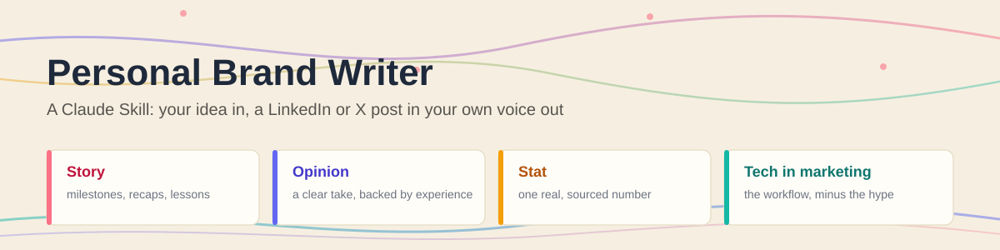
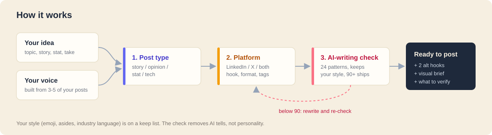

# Personal Brand Writer

A Claude Skill that turns a rough idea, a story, or a stat into a finished LinkedIn or X post that sounds like **you**: your humor, your phrases, your formatting habits. Then it checks the draft for AI tells before you see it.

## The problem it solves

Ask an AI to "write a LinkedIn post about my new role" and you get the same post everyone else gets: "I'm thrilled to announce...", three buzzwords per line, a generic ending. People scroll past it because it reads like nobody wrote it.

Most "humanizer" tools make it worse in a different way. They strip out everything that looks like AI, including the emoji, the industry vocabulary, and the asides that are actually *your* style.

This skill fixes both:
- **It learns your voice from your real posts**: your signature moves, the words you actually use, how you use emoji, how you sign off.
- **It writes to a structure for each kind of post**: story, opinion, stat, and tech-in-marketing posts each have a different job.
- **It formats for the platform**: LinkedIn's "...see more" cut-off, no markdown, 5 keyword hashtags; X's 280 characters and threads.
- **It runs a voice-aware AI-writing check**: 24 patterns, scored out of 100. Anything on your personal "keep list" is protected. Invented numbers are never allowed.

## How to use it (no coding required)

1. **Get the skill.** Download this folder (`personal-brand-writer`), either by cloning the whole repo or by downloading just this folder from GitHub.
2. **Add it to Claude.**
   - **Claude app (claude.ai or desktop):** turn on *Code execution and file creation* in Settings → Capabilities. Zip the `personal-brand-writer` folder, then go to Customize → Skills → **+** → Upload a skill. See [Anthropic's skills documentation](https://docs.claude.com/en/docs/agents-and-tools/agent-skills/overview) for details.
   - **Claude Code:** copy the whole folder into `~/.claude/skills/`.
3. **Make it yours.** This skill ships with *my* voice as the working example. Start a new chat and say:
   > Set up my voice. Here are some of my posts: [paste 3-5 posts]

   It studies them and builds your voice profile.
   - In **Claude Code**, it saves the profile automatically.
   - In the **Claude app**, it gives you a `voice-profile.md` file. Replace the one in the folder's `references/` folder, zip it again, and re-upload the skill.
4. **Write.** Just ask naturally:
   > Write a LinkedIn story post about the product marketing meetup I went to last night. The speaker said [...], and the thing that stuck with me was [...].

   It works out the post type and platform, asks a couple of questions if the details are thin, and hands back a ready-to-paste post.

## Example / demo

*Fictional example written in my voice. The input details are made up for the demo.*

**You give it:**
> Opinion post for LinkedIn. My take: most B2B messaging fails because it's written for the internal review, not the buyer. In past roles I've seen 12-page messaging docs signed off by everyone, while the homepage still said "AI-powered platform for enterprise transformation". What works for me: pull the problem statement from sales-call language, put one proof point above the fold, and test the headline on someone outside marketing.

**It gives you back:**

> Your buyers will never read your messaging doc. They'll read your homepage for 5 seconds and decide. 🤔
>
> Across 5 years in enterprise IT & B2B SaaS marketing, I've sat through more positioning workshops than I can count. (SMH, a few of them ran longer than the actual product sprint 😩)
>
> And the pattern is almost always the same:
> - A 12-page messaging doc everyone signed off on
> - A homepage headline that says "AI-powered platform for enterprise transformation"
> - A buyer who still can't tell what the product does
>
> What actually works, IMO:
> - Write the problem in the buyer's words. Pull it straight from sales calls, not the brainstorm.
> - Put ONE proof point above the fold. A result, a number, a customer.
> - Test the headline on someone outside marketing. If they can't say it back in one line, it's not done.
>
> Fair counterpoint: in complex enterprise deals, the full messaging doc still matters. Sales, partners, and analysts all need the whole story.
>
> But the homepage has one job. 💡
>
> Messaging is what the buyer repeats back to you. ⭐
>
> What's the vaguest B2B headline you've seen this year?
>
> #ProductMarketing #B2BMarketing #Positioning #Messaging #GTM
>
> ---
>
> **Alt hooks:** "Nobody outside your company has read your messaging framework." / "The best B2B headline test costs $0: ask someone in finance what you do." I'd keep the original. It names the reader's reality in the first line.
>
> **Visual:** optional. Two-column before/after: "What we wrote" vs "What the buyer heard".
>
> **Check:** 95/100. Fixed: removed "It's important to note", cut a second "not X, it's Y".
>
> **Flags:** none. No stats used.

## What's inside

| File | What it does |
|---|---|
| `SKILL.md` | The instructions Claude follows: the steps, the output format, voice setup |
| `references/voice-profile.md` | The active voice (mine, until you replace it) |
| `references/voice-template.md` | Blank template for a new voice |
| `references/post-types.md` | Structures for story, opinion, stat, and tech-in-marketing posts |
| `references/platforms.md` | LinkedIn and X formatting rules, visual briefs, threads |
| `references/humanizer.md` | The 24-pattern AI-writing check, voice-aware |

## Built with

Claude (as a Skill). Optionally, the Canva connector to turn the visual brief into a design.

Adapted from Eric Siu's [x-longform-post](https://github.com/ericosiu/ai-marketing-skills/tree/main/x-longform-post) and the content-ops humanizer rubric in [ai-marketing-skills](https://github.com/ericosiu/ai-marketing-skills) (MIT License). My changes: rebuilt for LinkedIn and X, four post types, voice setup from your own posts, and an AI-writing check that protects your style instead of flattening it. See [LICENSE](./LICENSE).
